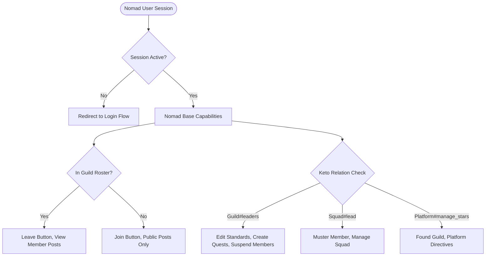

# Frontend Page Integration Audit (v3.1 Baseline)

> **Authority & Purpose**:  
> Comprehensive integration audit of all newly created and modified pages in the MAJARA Frontend repository as of Milestone 18 (`main`).  
> **Status**: Read-only architectural audit. Zero application code modified.  
> **Boundary Invariant**: The external Go 1.27 backend (`majara-backend`) is contractual authority only (`api/openapi.yaml`). Frontend modifications must strictly consume backend contracts without duplication or fabrication.

---

## 1. Page Inventory

| # | Page Name | World / Product Area | File Paths | Canonical Route / URL | Existing Components Reused | Newly Created Components |
|---|---|---|---|---|---|---|
| **1** | **Base Home** | `base` (Dashboard) | `src/features/base-home/BaseHomePage.tsx`<br>`src/features/base-home/baseHome.css.ts` | `base`<br>`/base` | `DiscoverSearchBar`<br>`SeasonLuminariesCard`<br>`CyberButtonFrameSvg` | `ProfileCard`<br>`ActiveQuestsSection`<br>`SquadGuildsCard` |
| **2** | **Guilds Directory** | `base` (Guilds) | `src/features/guilds/GuildsPage.tsx`<br>`src/features/guilds/guilds.css.ts` | `guilds`<br>`/guilds` | `DiscoverSearchBar`<br>`CyberPagination`<br>`CyberTagChip`<br>`CyberNavButtonSvg` | `GuildCard`<br>`GuildQuestsCard` |
| **3** | **Guild Detail** | `base` (Guilds Subview) | `src/features/guilds/components/GuildDetailPage.tsx`<br>`src/features/guilds/components/GuildDetailPage.css.ts` | *(None — in-memory state)*<br>`selectedGuild != null` | `CyberPagination`<br>`TopicAchievementCard`<br>`GuildQuestsCard.css` (tokens) | `CreateQuestModal`<br>`EditGuildModal`<br>Partners Card<br>Members Table<br>Rank Structure Card |
| **4** | **Squad Page** | `base` (Squads) | `src/features/squads/SquadPage.tsx`<br>`src/features/squads/squads.css.ts` | `squads`<br>`/squads` | `DiscoverSearchBar`<br>`CyberPagination`<br>`CyberTagChip`<br>`CyberNavButtonSvg` | `SquadCard`<br>`SquadQuestsCard`<br>*(Prior: `MusterModal`)* |
| **5** | **Discover Followings** | `discover` | `src/features/discover/DiscoverFollowingsPage.tsx` | `discover-followings`<br>`/discover/followings` | `DiscoverSearchBar`<br>`FollowedOperativesView`<br>`FollowedOperativeCard`<br>`SeasonLuminariesCard` | *(None — thin wrapper view)* |
| **6** | **Discover Topics** | `discover` | `src/features/discover/DiscoverTopicsPage.tsx` | `discover-topics`<br>`/discover/topics` | `DiscoverSearchBar`<br>`TopicsFeedView`<br>`TopicAchievementCard`<br>`SeasonLuminariesCard` | *(None — thin wrapper view)* |
| **7** | **Discover Feed** | `discover` (Home) | `src/features/discover/DiscoverPage.tsx` | `discover`<br>`/discover` (landing `/`) | `DiscoverSearchBar`<br>`SeasonLuminariesCard`<br>`NomadCommunityPostCard`<br>`ObservatoryQuestCard`<br>`Slot` (`feed.featured-card`) | *(Refactored to feed-only)* |

---

## 2. Interaction Inventory

| Page / Component | Interactive Control | Interaction Classification | Current Behavior / Target | Target Backend Endpoint / Flow |
|---|---|---|---|---|
| **Base Home** | Search Bar Input | Local presentation state | Logs search query to console | None (or global discover search query) |
| **Base Home** | "View Full Profile" Tag Button | Routing / navigation | `onNavigate?.('profile')` | Routes to canonical `/profile` |
| **Base Home** | "View All" Active Quests | Routing / navigation | `onNavigate?.('quests')` | Routes to canonical `/quests` |
| **Base Home** | "Mark as completed" Quest Button | Backend mutation (misaligned) | Logs quest ID to console | Multi-step attempt submit: `POST /v1/attempts/:id/submit` |
| **Base Home** | "View All" Squad & Guilds | Routing / navigation | `onNavigate?.('squads')` | Routes to canonical `/squads` |
| **Base Home** | Squad / Guild Row Click | Routing / navigation | `onNavigate?.('squads')` or `('guilds')` | Routes to `/squads` or `/guilds` |
| **Guilds Directory** | Search Bar Input | Local presentation state | Filters `filteredGuilds` in local state | `GET /v1/guilds?q=` (if supported) |
| **Guilds Directory** | Cyber Navigation Tabs | Local presentation state | `setActiveTab(tab)` | Filters directory by tab (`Your Guilds`, etc.) |
| **Guilds Directory** | "CREATE A GUILD" Button | Role/capability dependent (admin) | Logs message to console | `POST /admin/guilds` (Admin only) |
| **Guilds Directory** | Guild Card Click | Local presentation state (unrouted) | `setSelectedGuild(guild)` | Should deep-link `/guilds/:guildId` |
| **Guilds Directory** | Guild Quests "SHOW MORE" | Routing / navigation | `onNavigate?.('quests')` | Routes to canonical `/quests` |
| **Guilds Directory** | Guild Quest Row Click | Routing / navigation | `onNavigate?.('quests')` | Opens quest details modal / `/quests` |
| **Guilds Directory** | CyberPagination Buttons | Local presentation state | Updates `currentPage` | `GET /v1/guilds?limit=6&offset=X` |
| **Guild Detail** | "BACK TO GUILDS DIRECTORY" | Local presentation state | `onBack()` (`setSelectedGuild(null)`) | History back or `/guilds` |
| **Guild Detail** | "FOLLOW / FOLLOWING" Toggle | Backend mutation | Toggles local boolean state | `POST /v1/follows` / `DELETE /v1/follows/guild/:id` |
| **Guild Detail** | Secondary Nav Tabs (5) | Local presentation state | `setActiveTab(tab)` | Renders tab views: Home, About, Membres, Topics, Quests |
| **Guild Detail** | "Edit" Guild Button | Authorization (Keto: Sentinel/Admin) | Opens `EditGuildModal` | `PATCH /admin/guilds/:id` or leader self-service |
| **Guild Detail** | "Leave" Guild Button | Backend mutation | Triggers `onBack` | `POST /v1/guilds/:id/leave` |
| **Guild Detail** | Post / Quest "Start Quest" | Routing / navigation | `onNavigate?.('quests')` | `POST /v1/quests/:id/start` |
| **Guild Detail** | Member Search & Filter Tags | Local presentation state | Filters member array in memory | Backend roster search / filter |
| **Guild Detail** | Member Settings Button | Authorization (Leader/Council) | Unimplemented icon button | `POST /v1/guilds/:id/suspend`, promote, etc. |
| **Guild Detail** | Topic Like Button | Backend mutation | Optimistic increment in local state | Social like mutation endpoint |
| **Guild Detail** | "Add New Quest" Button | Authorization (Sentinel/Publisher) | Opens `CreateQuestModal` | `POST /v1/guilds/:id/quests` |
| **Squad Page** | Search Bar Input | Local presentation state | Filters `filteredSquads` in memory | `GET /v1/squads` |
| **Squad Page** | Cyber Navigation Tabs | Local presentation state | Updates `activeTab` | Tab filter |
| **Squad Page** | "CREATE A SQUAD" Button | Backend mutation | Logs message to console | `POST /v1/squads` |
| **Squad Page** | Squad Card Click | Local presentation state | Logs cell info to console | Squad detail / muster flow |
| **Squad Page** | Squad Quests "SHOW MORE" | Routing / navigation | `onNavigate?.('quests')` | Routes to canonical `/quests` |
| **Discover Followings** | Unfollow Button | Backend mutation | Calls `useDiscoverFlow.unfollow()` | `DELETE /v1/follows/:type/:id` |
| **Discover Followings** | Retry Button | Backend read | Calls `useDiscoverFlow.reload()` | `GET /v1/me/follows` + `GET /v1/leaderboards/season` |

---

## 3. Form Analysis

### Form 1: `CreateQuestModal` (Guild Quest Creation Wizard)
- **Component**: `src/features/guilds/components/CreateQuestModal.tsx`
- **Steps**: 5 distinct steps (`DETAILS`, `REWARD`, `ELIGIBILITY GATE & DURATION`, `HOW TO DO IT`, `SUBMISSION REQUIREMENTS`).
- **Fields Audit**:
  - `title` (text, required): Quest title.
  - `subtitle` (text, optional): In backend, `QuestBody` has no subtitle. Must be merged into `instructions`.
  - `category` (select, options: `hardware`, `software`, `ai`, `security`, `telemetry`): In backend, quests belong to a `star_id`, not an arbitrary category string.
  - `star` (select, options: `deep_space`, `afrobot`, `canvas`, `synapse`): Maps directly to `star_id`.
  - `visibility` (radio: `public` vs `guild_only`): Backend schema expects `public`, `guild`, `role`, or `private`.
  - `atharReward` (text/number): Maps to `athar_reward` (`int`).
  - `zedReward` (text/number): Maps to `zad_reward` (`int64`).
  - `partner` (text input): Backend expects array of partner UUIDs `partner_ids: string[]`.
  - `badge` (file drop zone): Badges in backend are referenced via `required_badge` (string ID) or issued via guild badge definitions.
  - `minRank` (display box: `Gold II`): Backend expects domain rank string (`Spark`, `Apprentice`, `Vanguard`, `Sentinel`, `Luminary`).
  - `deadline` (date input): Backend `QuestBody` has no deadline field.
  - `howToDoIt` (read-only bullet points): Hardcoded in UI. Should map to `instructions`.
  - `submissionInstructions` (read-only bullet points): Hardcoded in UI. Should map to `instructions`.
  - `proofType` (select: `pr_commit`, `qr_scan`, `telemetry_log`, `crypto_tx`): Backend attempt submission accepts `evidence_key` (file) or text/quiz.
  - `verificationMechanism` (radio: `auto` vs `manual`): Maps directly to `require_approval: boolean` (`auto` = `false`, `manual` = `true`).
- **Validation**: Zero client-side validation currently implemented; allows proceeding on empty fields.
- **Submit Action**: Calls `onSuccess(formData)` then closes modal.
- **Contract Target**: `POST /v1/guilds/{id}/quests` (`QuestBody`).
- **Error & Edge Cases**: Needs 401 session check, 403 authorization check (only guild leaders/sentinels with publish permissions can create quests), 422 TypeBox validation, and AbortSignal support.

### Form 2: `EditGuildModal` (Guild Settings & Rank Wizard)
- **Component**: `src/features/guilds/components/EditGuildModal.tsx`
- **Steps**: 4 steps (`GUILD INFOS`, `GUILD STANDARDS`, `INTERNAL TIERS STRUCTURE`, `ADD NEW RANK`).
- **Fields Audit**:
  - Step 1: `guildName`, `tagline`, `fullDescription`, `primaryStar`, `visibility`.
  - Step 2: `joinMechanism` (`open`, `approval`, `invite`, `token`), `minTier` (`spark`, `luminary`, `archon`, `sentinel`), `mandatoryBadge`, `trialPeriod`.
  - Step 3: View rank tiers + "ADD NEW RANK" button.
  - Step 4: `newRankName` (text), badge upload drop zone.
- **Architectural Discrepancy & Critical Domain Invariant**:
  - In backend domain rules (`majara-backend/AGENTS.md §1 & §18`), **Guild rank structure is strictly fixed**: `Spark -> Apprentice -> Vanguard -> Sentinel -> Luminary`.
  - Nomads and guild leaders CANNOT invent custom rank names.
  - Furthermore, general guild updates (name, tagline, primary star) require `admin` platform permissions (`PATCH /admin/guilds/:id`).
  - Guild leaders have self-service endpoints only for:
    - `POST /v1/guilds/:id/join-badge` (setting mandatory join badge)
    - `POST /v1/guilds/:id/publisher-rank` (setting minimum rank to publish quests)
    - `POST /v1/guilds/:id/leaders` / `successor` / `nominate`
- **Submit Action**: Calls `onSave(formData)` and closes.
- **Error & Edge Cases**: Form must be decomposed into real leader actions vs admin patch actions.

### Form 3: `MusterModal` (Nomad Tactical Cell Muster)
- **Component**: `src/features/squads/components/MusterModal.tsx`
- **Fields**: `profileId` (UUID string).
- **Validation**: Basic whitespace check `!profileId.trim()`. Needs UUID regex check (`/^[0-9a-f]{8}-[0-9a-f]{4}-[1-8][0-9a-f]{3}-[89ab][0-9a-f]{3}-[0-9a-f]{12}$/i`).
- **Submit Action**: Calls `onMuster(squadId, profileId.trim())`.
- **Contract Target**: `POST /v1/squads/{id}/muster`.
- **Handling**: Propagates `isMutating` state, displays `error` string banner.

### Form 4: Search Controls
- **Components**: `DiscoverSearchBar`, `GuildDetailPage` search fields.
- **Current Behavior**: Purely local React state (`useState`) filtering in-memory arrays.
- **Target Architecture**: In-page filtering is suitable for sub-views, but Top Search Bar should either navigate or search across entities via backend query endpoints.

---

## 4. Role & Capability Analysis

The platform follows a strict ReBAC model via Ory Keto. Frontend components must distinguish between **UX gating** (optimistic visibility) and **authoritative backend authorization** (enforced by Keto returning 403).



### Role Matrix & UI Gating

| Role / Capability | UI Element Affected | Information Source | UX Gating Behavior | Backend AuthZ Enforced At | Expected 403 Handling |
|---|---|---|---|---|---|
| **Unauthenticated Guest** | Entire Application Shell | Kratos Session (`whoami`) | Redirected to `LoginPage` / Auth Machine | All `/v1/*` routes (except `/healthz`, `/v1/stars`, `/v1/guilds`, `/v1/observatories`, `/v1/bounties`) | HTTP 401 -> Dispatches `majara:auth-required` |
| **Unonboarded Nomad** | Feature Pages vs Onboarding | `useOnboardingGate` (`GET /v1/onboarding`) | Shell trapped in `OnboardingPage` until complete | Fail-closed gate | Displays telemetry offline banner |
| **Nomad (Public)** | "CREATE A SQUAD" | Session Profile | Visible to any authenticated nomad | `POST /v1/squads` | None (all nomads can form a squad) |
| **Nomad (Public)** | "CREATE A GUILD" | Platform Role (`Platform#manage_stars`) | Currently visible to all (Incorrect) | `POST /admin/guilds` | HTTP 403: "Platform admin permission required" |
| **Guild Non-Member** | Guild Header Action | `callerMemberships` map | Renders "JOIN GUILD" button | `POST /v1/guilds/:id/join` | HTTP 400 if already member |
| **Guild Member** | Guild Header Action | `callerMemberships` map | Renders "LEAVE GUILD" button | `POST /v1/guilds/:id/leave` | HTTP 400 if not member |
| **Guild Member** | "Latest Posts" Tab | Guild Membership tuple | Visible in full | `GET /v1/guilds/:id/posts` | HTTP 403: Non-members receive 403 |
| **Guild Sentinel / Leader** | "Add New Quest" Button | Guild Rank (`>= Sentinel` or publisher rank) | Visible only to leaders / sentinels | `POST /v1/guilds/:id/quests` | HTTP 403: "Guild leaders and sentinels only" |
| **Guild Leader / Council** | "Edit" Guild Button | Keto `Guild#leaders` tuple | Visible only to council members | `POST /v1/guilds/:id/join-badge`, `/publisher-rank` | HTTP 403 verbatim message rendered |
| **Guild Leader / Council** | Member Settings Button | Keto `Guild#leaders` tuple | Visible only to council members | `POST /v1/guilds/:id/suspend` | HTTP 403 verbatim message rendered |
| **Squad Lead** | Squad Card Actions / Muster | `squad.role === 'lead'` | Renders "Muster" action | `POST /v1/squads/:id/muster` | HTTP 403 if caller is not squad member |

---

## 5. Backend Mapping

The following contracts are verified directly against `majara-backend/api/openapi.yaml`:

### 1. Base Home Data Aggregation
- **Profile Summary**:
  - `GET /v1/profiles/{username}`
  - Auth: `RequireSession`
  - Response: `200 OK` -> `Profile` (contains `athar`, `ranks`, `pseudonym`, `avatar_url`).
- **Active Quests / Attempts**:
  - `GET /v1/me/attempts`
  - Auth: `RequireSession`
  - Response: `200 OK` -> `Attempt[]` (with edge `quest`). Filter `status: 'in_progress'`.
- **My Squads**:
  - `GET /v1/squads/mine`
  - Auth: `RequireSession`
  - Response: `200 OK` -> `Squad[]` (with member role).
- **Guild Luminaries (Season Leaderboard)**:
  - `GET /v1/leaderboards/season`
  - Auth: `RequireSession`
  - Response: `200 OK` -> `SeasonBoard` (`top_podium`, `chase_list`).

### 2. Guilds Directory
- **Guilds Catalog**:
  - `GET /v1/guilds?limit={limit}&offset={offset}`
  - Auth: Public (No session required).
  - Response: `200 OK` -> `Guild[]` (`id`, `name`, `tagline`, `description`, `primary_star_id`, `created_at`, `status`).
- **Guild Founding** *(Admin Only)*:
  - `POST /admin/guilds`
  - Auth: `RequireSession` + Keto `Platform/platform#manage_stars`.
  - Body: `GuildBody { name, tagline, description, primary_star_id, direct_publish_cap }`.
  - Response: `201 Created` -> `Guild`.

### 3. Guild Detail & Governance
- **Guild Specification**:
  - `GET /v1/guilds/{id}`
  - Auth: Public.
  - Response: `200 OK` -> `GuildDetail`.
- **Guild Posts Feed**:
  - `GET /v1/guilds/{id}/posts?limit={limit}&offset={offset}`
  - Auth: `RequireSession` (Members only; returns `403` to non-members).
  - Response: `200 OK` -> `GuildPost[]` (`id`, `title`, `content`, `author`, `created_at`).
- **Guild Best Membres (Leaderboard)**:
  - `GET /v1/guilds/{id}/leaderboard`
  - Auth: `RequireSession`.
  - Response: `200 OK` -> `LeaderboardEntry[]` (`rank`, `nomad_callsign`, `avatar_url`, `athar`).
- **Guild Quest Creation**:
  - `POST /v1/guilds/{id}/quests`
  - Auth: `RequireSession` (Leaders and Sentinels only).
  - Body: `QuestBody` (`title`, `instructions`, `star_id`, `athar_reward`, `zad_reward`, `visibility`, `require_approval`, `required_rank`, `required_badge`).
  - Response: `201 Created` -> `Quest`.
- **Join / Leave Guild**:
  - `POST /v1/guilds/{id}/join` -> `201 Created` (`Membership`).
  - `POST /v1/guilds/{id}/leave` -> `204 No Content`.
- **Guild Governance Self-Service**:
  - `POST /v1/guilds/{id}/join-badge` -> Body: `{ badge_id: string }` -> `200 OK`.
  - `POST /v1/guilds/{id}/publisher-rank` -> Body: `{ rank: string }` -> `200 OK`.
  - `POST /v1/guilds/{id}/suspend` -> Body: `{ member_profile_id: string }` -> `200 OK`.

### 4. Squads
- **My Squads**:
  - `GET /v1/squads/mine` -> `200 OK` -> `Squad[]`.
- **Create Squad**:
  - `POST /v1/squads`
  - Body: `{ name: string, observatory_id?: string }`
  - Response: `201 Created` -> `Squad`.
- **Muster Member**:
  - `POST /v1/squads/{id}/muster`
  - Body: `{ profile_id: string }`
  - Response: `201 Created` -> `SquadMember`.
- **Leave Squad**:
  - `POST /v1/squads/{id}/leave` -> `204 No Content`.

---

## 6. Routing Mapping

```text
CANONICAL ROUTE ARCHITECTURE (Milestone 18 Baseline)

/ (root) ──────► Canonical replace: /discover (Discover Feed)
├── /discover
│   ├── /discover/followings  (DiscoverFollowingsPage)
│   ├── /discover/topics      (DiscoverTopicsPage)
│   └── /map                  (MapPage — Canonical Owner: Discover)
│
├── /base                     (BaseHomePage — Base Home Dashboard)
│   ├── /profile              (ProfilePage — Logbook Dossier)
│   ├── /squads               (SquadPage — Tactical Cells)
│   ├── /guilds               (GuildsPage — Guild Directory)
│   └── /map                  (Navigation Alias — Placement Only)
│
└── /quests                   (QuestsPage — Playground)
    └── /bounties             (BountiesPage — Playground)
```

### Route Audit & Deep-Linking Analysis
1. **Canonical Base Home**:
   - Route `base` maps to `/base`.
   - Owned by `base` world in `WORLD_REGISTRY` with `order: 0`, `landingRoute: 'base'`.
   - Fully aligned with `M18_IMPLEMENTATION_PLAN.md`.
2. **Guilds Directory**:
   - Route `guilds` maps to `/guilds`.
   - Owned by `base` world with `order: 3`.
3. **Critical Routing Gap — Guild Detail (`GuildDetailPage`)**:
   - Currently, `GuildDetailPage` is rendered **in-place via local state** inside `GuildsPage.tsx`:
     ```tsx
     {selectedGuild ? <GuildDetailPage ... /> : <GuildsDirectoryGrid ... />}
     ```
   - **Consequence**:
     - Cannot be bookmarked or deep-linked.
     - Browser "Back" button leaves the `/guilds` page entirely instead of returning from Guild Detail to the Guilds Directory.
     - Refreshing the page loses the active guild view.
   - **Required Routing Evolution**:
     - Introduce parameterized canonical route: `/guilds/:guildId`.
     - RouteMatch: `{ kind: 'route', route: 'guilds', guildId?: string }`.
4. **Squad Page**:
   - Route `squads` maps to `/squads`.
   - Owned by `base` world with `order: 2`.
   - Same consideration if Squad Detail page is introduced (`/squads/:squadId`).

---

## 7. Architecture Mapping

Every backend interaction MUST follow the strict MAJARA pipeline:


### Discipline on Repositories
Repositories are **prohibited** as empty pass-through abstractions. A repository is introduced **only when at least one policy invariant exists**:

| Feature Area | Repository Introduced? | Policy Justification |
|---|---|---|
| **Guilds** | `guildRepository.ts` (**Yes**) | 1. 60s TTL cache on `fetchGuilds`, 30s on `fetchGuildDetail`.<br>2. Invalidation upon `joinGuild`, `leaveGuild`, `createGuildQuest`.<br>3. RequestSequencer (ADR-028) preventing race conditions.<br>4. Mutation concurrency locks. |
| **Squads** | `squadRepository.ts` (**Yes**) | 1. 30s TTL cache on `fetchMySquads`.<br>2. Mutation lock on `createSquad` / `musterSquad`.<br>3. AbortController cleanup. |
| **Base Home** | `baseHomeRepository.ts` (**Yes**) | 1. Parallel aggregation of Profile, Active Quests, and Squad/Guild memberships.<br>2. Short-lived 15s TTL.<br>3. Non-blocking error containment (e.g. squads failure does not crash profile). |
| **Discover Followings** | `discoverRepository.ts` (**Yes**) | Caching + deduplication across followed entities. |
| **Topics Feed** | **No** (Hook only) | Ephemeral read stream; no offline store or complex cache. |

---

## 8. Reusable Components & Design System Audit

### Component Promotion Opportunities
1. **`CyberPagination`**:
   - Current Path: `src/features/discover/components/CyberPagination.tsx`
   - Audit Finding: Now utilized across `DiscoverFollowingsPage`, `GuildsPage`, `GuildDetailPage` (Membres & Quests tabs), and `SquadPage`.
   - **Action**: Promote from `src/features/discover/` to `src/components/CyberPagination.tsx`.
2. **`CyberSearchBar`**:
   - Current Path: `src/features/discover/DiscoverSearchBar.tsx`
   - Audit Finding: Reused across `BaseHomePage`, `GuildsPage`, `SquadPage`, `DiscoverFollowingsPage`, and `DiscoverTopicsPage`.
   - **Action**: Promote to `src/components/CyberSearchBar.tsx`.
3. **`DualCurrencyRewardBadge` (Rewards Pill)**:
   - Already created at `src/components/DualCurrencyRewardBadge.tsx`.
   - Audit Finding: `GuildDetailPage` and `ActiveQuestsSection` manually reconstruct HTML/CSS for `+100 ATHAR` and `+50 Zad` pills instead of importing `DualCurrencyRewardBadge`.
   - **Action**: Refactor all quest rows and cards to consume `DualCurrencyRewardBadge`.
4. **Corner Brackets**:
   - Reused across `ProfileCard`, `SquadGuildsCard`, `GuildDetailPage` cards, and modals.
   - Standardize on `src/components/CornerBrackets.tsx` instead of arbitrary SVG image tags.

### Design System Violations (Rule Invariants)
- **Inline Styles**:
  - `GuildDetailPage.tsx:370, 402, 628, 1015`
  - `CreateQuestModal.tsx:297, 320`
  - `DiscoverFollowingsPage.tsx:26-37`
  - `DiscoverTopicsPage.tsx:15-26`
  - `MusterModal.tsx:47, 50, 62, 74, 86, 101, 114, 136`
  - *Invariant*: **Zero raw CSS strings / zero un-scoped inline styles (`AGENTS.md §6`)**. Must be moved into `.css.ts` Vanilla Extract modules.
- **Hardcoded Hex Tokens**:
  - `baseHome.css.ts`: `#000000`, `rgba(0, 0, 0, 0.45)` (Should use `vars.color.bgBlack`).
  - `ProfileCard.css.ts`: `#FEFEFF`, `#FFA100`, `#994D00`, `#D68904`.
  - `GuildDetailPage.css.ts`: `#C5C9C6`, `#E6A23C`, `#3B4750`, `#8C9BAE`, `#F45B69`.
  - *Invariant*: Use typed design tokens via `vars.color.*` and `vars.font.*`.
- **Hardcoded Font Declarations**:
  - Instances of `fontFamily: 'Space Grotesk'` and `fontFamily: 'Space Mono'` in inline styles must use `vars.font.display` and `vars.font.mono`.

---

## 9. Issues & Risks

| # | Severity | Issue / Risk | Impact | Recommended Solution |
|---|---|---|---|---|
| **R1** | **High** | **"Create A Guild" Permission Mismatch** | Nomads in UI are presented with a "CREATE A GUILD" button, but backend route `POST /admin/guilds` is strictly admin-gated (`Platform#manage_stars`). Non-admins will receive HTTP 403. | Hide button for standard nomads; show only if caller possesses Platform Admin relation, or redirect to a "Request Guild Founding" proposal flow. |
| **R2** | **High** | **"Mark as completed" Lifecycle Mismatch** | Base Home has a simple "Mark as completed" button. In backend, quests require starting an attempt, gathering evidence, and submitting (`POST /v1/attempts/:id/submit`). | Replace direct completion button with "Submit Evidence" / "Continue Attempt", which opens `QuestDetailsModal`. |
| **R3** | **High** | **Arbitrary Rank Creation in Edit Guild** | `EditGuildModal` Step 4 allows adding custom rank names. Backend domain invariant specifies a fixed 5-tier rank ladder (`Spark -> Apprentice -> Vanguard -> Sentinel -> Luminary`). | Remove "Add New Rank" step; restrict modal to configuring join requirements and publisher threshold. |
| **R4** | **Medium** | **Unrouted Guild Detail Page** | `GuildDetailPage` is an in-memory view. Deep-linking, refreshing, and browser navigation (back/forward) break. | Promote `/guilds/:guildId` to canonical routing in `routes.ts` and `routeParser.ts`. |
| **R5** | **Medium** | **Lack of Loading / Empty / Error States** | `BaseHomePage`, `GuildsPage`, and `SquadPage` render static arrays with no loading spinners, empty notices, or error retry banners. | Implement standardized loading/empty/error states backed by application flow hooks. |
| **R6** | **Low** | **Vanilla Extract Invariant Violations** | Inline `style={{ ... }}` objects and un-tokenized hex colors in `GuildDetailPage`, modals, and wrappers. | Refactor inline styles into `.css.ts` classes consuming `vars` contract. |

---

## 10. Open Product Decisions

- **[D1] Guild Detail Route Modeling**:
  - *Question*: Should `/guilds/:guildId` become a canonical top-level route in `CANONICAL_APP_ROUTES`, or should it be modeled as a sub-route under `guilds`?
  - *Recommendation*: Add `{ kind: 'route', route: 'guilds', guildId?: string }` to `RouteMatch` and serialize to `/guilds/:guildId`, matching the existing `/bounties/:bountyId` pattern.
- **[D2] Guild Founding Workflow**:
  - *Question*: Will Nomad operatives have a self-service guild founding workflow, or does it remain strictly an administrator capability?
  - *Recommendation*: If nomad self-service is planned for a future milestone, disable or hide "CREATE A GUILD" for now to prevent HTTP 403 errors.
- **[D3] Quest Quick-Action on Base Home**:
  - *Question*: What should clicking "Mark as completed" on Base Home do for non-quiz quests?
  - *Recommendation*: Trigger the existing `QuestDetailsModal` with the evidence upload drop zone pre-focused.
- **[D4] Top Search Bar Scope**:
  - *Question*: Is the search bar on Base/Guilds/Squads purely local to the active view, or does it trigger global system search?
  - *Recommendation*: Keep as local client-side filter for P0, with debounce and clear button.

---

## 11. Recommended Implementation Order

To maintain strict boundary invariants and verify code changes at each stage, proceed in the following 6 sequential phases:

```text
PHASE 1: Contracts & TypeBox Schemas
└── Extend src/contracts/guilds.ts & quests.ts with complete OpenAPI shapes (QuestBody, GuildPost, etc.)

PHASE 2: Granular Domain Transports
└── Enhance src/services/api/guildApi.ts with createGuildQuest, fetchGuildPosts, fetchGuildLeaderboard
└── Enhance src/services/api/squadApi.ts with squad founding and muster methods

PHASE 3: Application Flows & Repositories
└── Implement useGuildsFlow & guildRepository (TTL cache, sequencer, mutation locks)
└── Implement useBaseHomeFlow (parallel aggregation of profile, quests, squads)
└── Implement useSquadsFlow integration with SquadPage

PHASE 4: Routing & Deep-Linking Alignment
└── Add guildId? parameter to RouteMatch in src/contracts/routes.ts
└── Update routeParser.ts to parse and serialize /guilds/:guildId
└── Wire history push/pop support

PHASE 5: UI Integration & Design System Polish
└── Connect BaseHomePage, GuildsPage, GuildDetailPage, and SquadPage to flow hooks
└── Promote CyberPagination and CyberSearchBar to src/components/
└── Replace inline styles with Vanilla Extract .css.ts classes
└── Implement loading, empty, and error fallback UI

PHASE 6: Automated Verification & Budgets
└── Write unit & integration tests (tests/guilds-flow.test.ts, tests/base-home-flow.test.ts)
└── Run test suite: pnpm typecheck && pnpm check:boundaries && pnpm test && pnpm build && pnpm check:size
```
